#  청춘은 바로 지금! (청바지)

#### <span style = "background : orange; color : #000;">"청바지" (청춘은 바로 지금) </span> 프로젝트는 건강에 관심이 많은 액티브 시니어를 대상으로 AI 기반 건강 정보 분석 서비스 및 다양한 공공의료기관, 요양원, 복지시설 정보를 제공합니다.

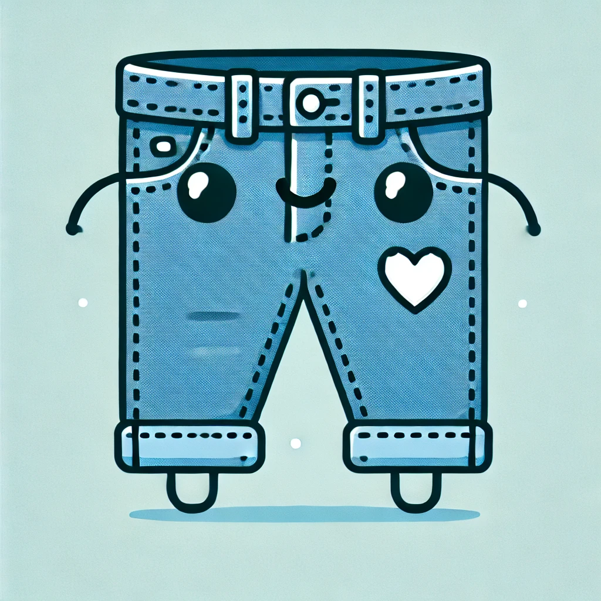

## 🍚 프로젝트 소개

💡 대한민국은 2017년 고령사회에 진입했으며, 2024년 말에서 2025년 초에는 노인 인구가 전체 인구의 20%를 차지하는 **초고령사회**에 접어들 것으로 예상됩니다. 인구는 감소하고 노인 복지 비용은 증가하는
가운데, 은퇴 후에도 활발한 사회 활동과 여가를 즐기며 능동적으로 생활하고자 하는 50~60대 액티브 시니어들이 점점 늘어나고 있습니다.

이에 따라, **"청바지" (청춘은 바로 지금)** 프로젝트는 건강에 관심이 많은 액티브 시니어를 대상으로 AI 기반 건강 정보 분석 서비스 및 다양한 공공의료기관, 요양원, 복지시설 정보를 제공합니다.
**"청바지"는 단순한 건강 정보 제공을 넘어, 시니어들이 보다 행복하고 활기찬 삶을 영위할 수 있도록 돕는 플랫폼을 목표로 합니다.** 초고령사회에서도 젊은 마음으로 살아가려는 액티브 시니어들의 든든한 동반자가
되겠습니다.


<br>
<br>

## ⛓️ 배포 URL

[서비스 링크](https://chungbaji.kro.kr)

<br>
<br>

## ⌛ 개발 기간

### 2024. 11.22 ~ 12.20

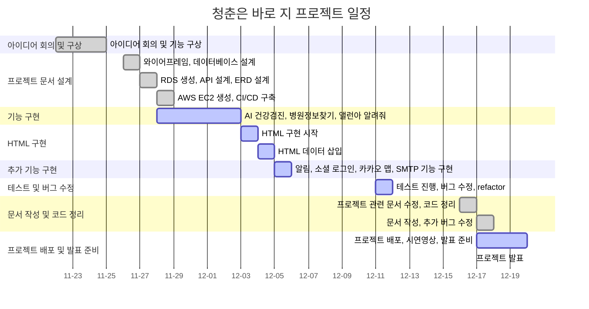

<br>
<br>

## 🏔️ 개발 환경

### Development

      

### Environment


### Communication


<br>
<br>

## 🍜 기능 정의서

➡️ [notion 에서 확인하기](https://oreumi.notion.site/cc4079b6409c4ea9b9ce336d385ba51c?pvs=4)

### ⭐ 주요 기능

- AI 건강 검진
- 병원 정보 찾기
- 앨런아 알려줘

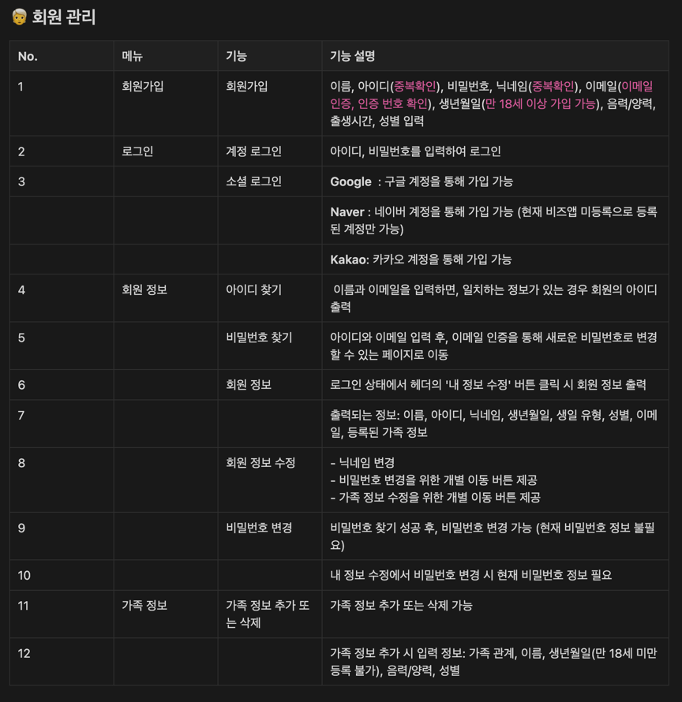
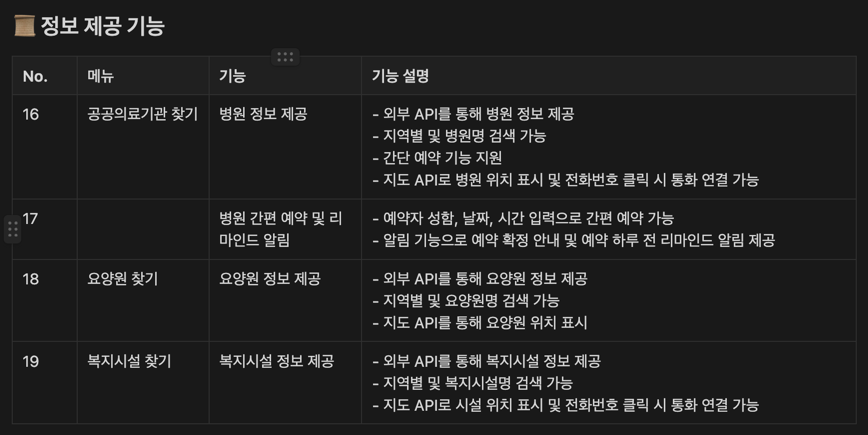
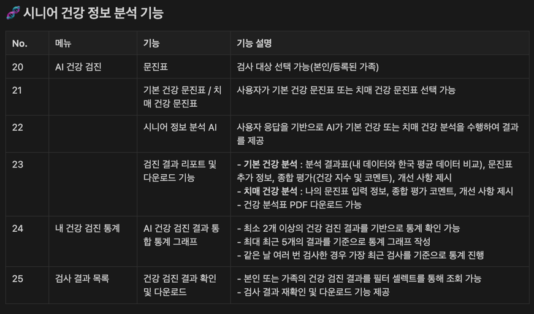
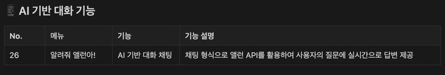
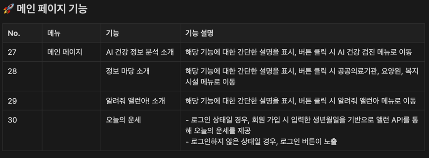
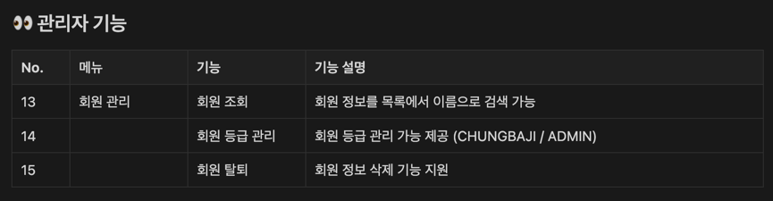

<br>
<br>

## Sequence Diagram

### 건강 정보 분석

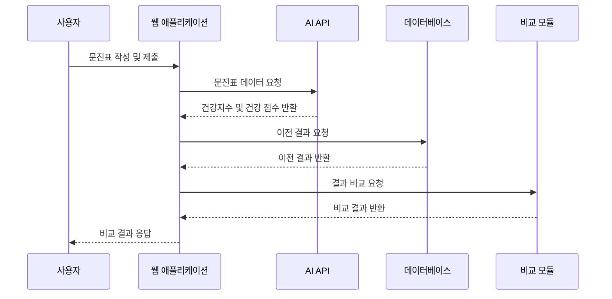

### 앨런아 알려줘

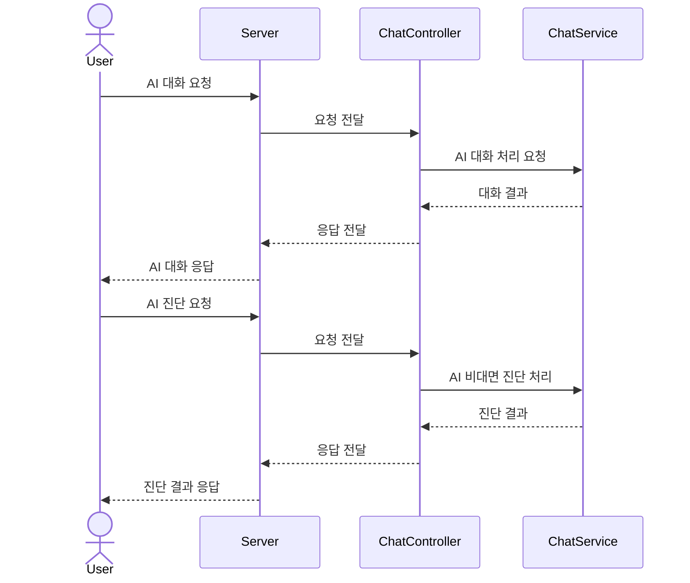

### 병원 정보 찾기

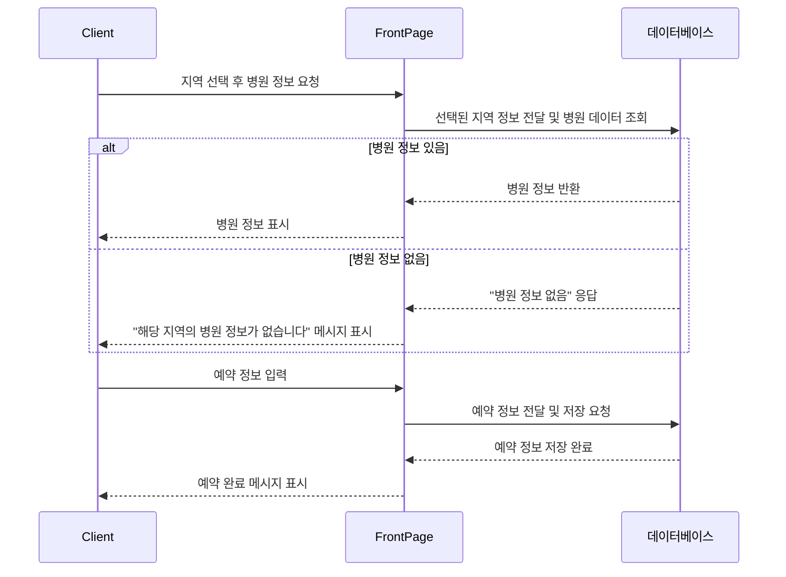

<br>
<br>

## 👀 화면 설계

➡️ [figma 에서 확인하기](https://www.figma.com/design/E9nwpp2MsdbKAIoSyrQ6Ot/%EC%B2%AD%EB%B0%94%EC%A7%80---%EC%99%80%EC%9D%B4%EC%96%B4%ED%94%84%EB%A0%88%EC%9E%84?node-id=0-1&t=LJryapQWiEW2EZ3k-1)

### ✅ 프론트

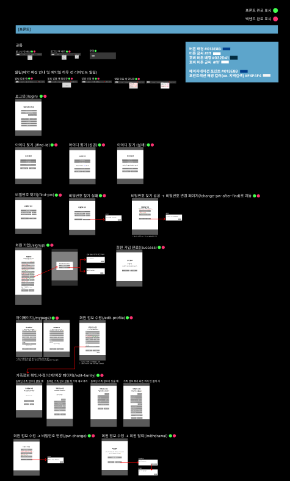
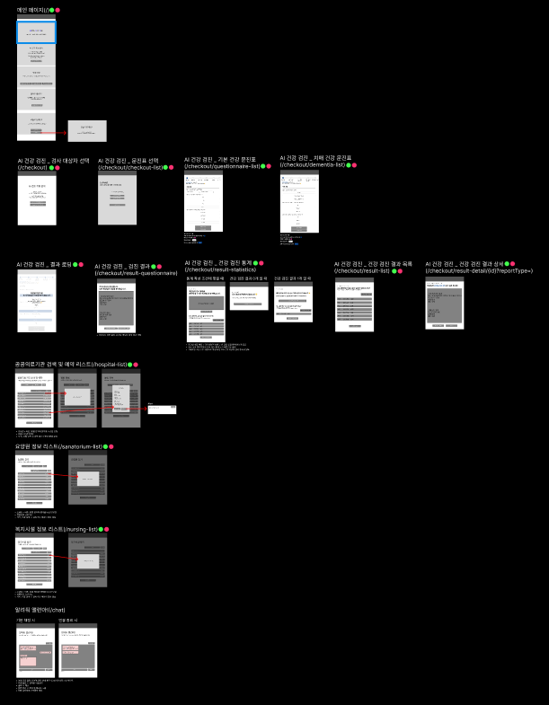

### ✅ 관리자

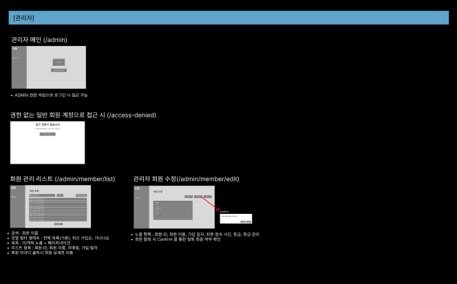

<br>
<br>

## 🛫 ERD(Entity Relationship Diagram)

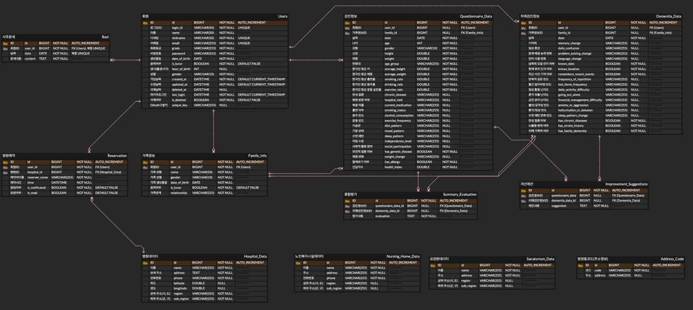

<br>
<br>

# **청바지 프로젝트 API 문서**

## 🚀 **1. REST API**

### 📌 **유저 관리**

| **Method** | **URL**                           | **Description**  |
|------------|-----------------------------------|------------------|
| POST       | `/api/users/register`             | 회원가입             |
| GET        | `/api/users/{userId}`             | 유저 정보 조회 (마이페이지) |
| PUT        | `/api/users/{userId}`             | 회원 정보 수정         |
| POST       | `/api/users/withdrawal`           | 회원 탈퇴 (소프트 딜리트)  |
| DELETE     | `/api/users/{userId}`             | 회원 삭제            |
| POST       | `/api/users/searchId`             | 아이디 찾기           |
| POST       | `/api/users/checkId`              | 아이디 중복 확인        |
| POST       | `/api/users/checkNickname`        | 닉네임 중복 확인        |
| POST       | `/api/users/checkEmail`           | 이메일 중복 확인        |
| POST       | `/api/users/checkEmailAndLoginId` | 비밀번호 찾기 시 이메일 확인 |
| GET        | `/api/users/nickname`             | 로그인된 유저 닉네임 반환   |

---

### 👨‍👩‍👧 **가족 정보**

| **Method** | **URL**                  | **Description** |
|------------|--------------------------|-----------------|
| POST       | `/api/family`            | 가족 정보 저장        |
| GET        | `/api/family`            | 가족 정보 조회        |
| DELETE     | `/api/family/{familyId}` | 가족 정보 삭제        |

---

### 🧧 **운세**

| **Method** | **URL**     | **Description** |
|------------|-------------|-----------------|
| GET        | `/api/bazi` | 오늘의 운세 결과 출력    |

---

### 🩺 **건강검진**

| **Method** | **URL**                       | **Description** |
|------------|-------------------------------|-----------------|
| POST       | `/api/analysis/questionnaire` | 기본 문진표 분석       |
| POST       | `/api/analysis/dementia`      | 치매 관련 문진표 분석    |

---

### 💬 **대화 기능**

| **Method** | **URL**                  | **Description** |
|------------|--------------------------|-----------------|
| GET        | `/api/chat/stream`       | SSE 연결          |
| GET        | `/api/chat/send`         | 메시지 전송 및 브로드캐스트 |
| POST       | `/api/chat/stream/close` | SSE 연결 종료       |

---

### 🏥 **병원 관리**

| **Method** | **URL**                  | **Description** |
|------------|--------------------------|-----------------|
| POST       | `/api/hospitals`         | 전체 병원 목록 저장     |
| GET        | `/api/hospitals`         | 병원 목록 조회        |
| GET        | `/api/hospitals/search/` | 병원 이름으로 검색      |

---

### 🏥 **요양 병원 관리**

| **Method** | **URL**           | **Description** |
|------------|-------------------|-----------------|
| POST       | `/api/sanatorium` | 요양 병원 목록 저장     |
| GET        | `/api/sanatorium` | 요양 병원 목록 조회     |

---

### 🏠 **복지 시설 관리**

| **Method** | **URL**        | **Description** |
|------------|----------------|-----------------|
| POST       | `/api/nursing` | 복지 시설 목록 저장     |
| GET        | `/api/nursing` | 복지 시설 목록 조회     |

---

### 🌐 **지역 주소 저장**

| **Method** | **URL**             | **Description** |
|------------|---------------------|-----------------|
| POST       | `/api/address-code` | 주소코드 매핑 정보 저장   |

---

### 🔐 **관리자**

| **Method** | **URL**                  | **Description** |
|------------|--------------------------|-----------------|
| POST       | `/api/admin/login`       | 관리자 로그인         |
| GET        | `/api/admin/users`       | 관리자 회원 관리 리스트   |
| GET        | `/api/admin/member-list` | 회원 이름 검색        |

---

### 📅 **예약**

| **Method** | **URL**                      | **Description** |
|------------|------------------------------|-----------------|
| GET        | `/api/reservation/stream`    | SSE 연결          |
| POST       | `/api/reservation`           | 예약 추가하기         |
| GET        | `/api/reservations`          | 전체 예약 정보 조회     |
| GET        | `/api/notifications`         | 전체 알림 정보 조회     |
| DELETE     | `/api/reservation/{id}`      | 알림 삭제           |
| PATCH      | `/api/reservation/read/{id}` | 알림 읽음 여부 토글     |

---

## 🌐 **2. 랜더링 관련 API**

### 🏠 **메인**

| **Method** | **URL** | **HTML File Name** | **Description** |
|------------|---------|--------------------|-----------------|
| GET        | `/`     | `index.html`       | 메인 화면           |

---

### 👤 **유저 페이지**

| **Method** | **URL**   | **HTML File Name** | **Description** |
|------------|-----------|--------------------|-----------------|
| GET        | `/login`  | `login.html`       | 로그인             |
| GET        | `/signup` | `signup.html`      | 회원가입            |
| POST       | `/signup` | `signup.html`      | 회원가입 처리         |

---

### 🏥 **병원 관리**

| **Method** | **URL**          | **HTML File Name**   | **Description** |
|------------|------------------|----------------------|-----------------|
| GET        | `/hospital-list` | `hospital-list.html` | 병원 목록 리스트       |

---

### 🔧 **3. 관리자 페이지**

| **Method** | **URL**              | **HTML File Name**   | **Description** |
|------------|----------------------|----------------------|-----------------|
| GET        | `/admin`             | `admin-index.html`   | 관리자 메인 페이지      |
| GET        | `/admin/member/list` | `member-list.html`   | 회원 목록           |
| GET        | `/access-denied`     | `access-denied.html` | 접근 제한 페이지       |

<br>
<br>

## 👾 프로젝트 구조

### 🚶‍♀️‍➡️Front-End

```
📁main 
└── 📁resources 
    ├── 📁static 
    │   ├── 📁admin   
    │   │   └── 📁css 
    │   ├── 📁css 📂  
    │   │   ├── 📁checkout 
    │   │   ├── 📁info 
    │   │   └── 📁member  
    │   ├── 📁img️  
    │   └── 📁js 
    └── 📁templates  
        ├── 📁admin 
        │   ├── 📁layout 
        │   └── 📁member  
        ├── 📁chat  
        ├── 📁checkout 
        ├── 📁error 
        ├── 📁info 
        ├── 📁layout 
        └── 📁member 
```

### 🚶‍♂️ Back-End

```
└── 📁main  
    └── 📁java  
        └── 📁com  
            └── 📁example  
                └── 📁classicjeans  
                    ├── 📁addresscode   
                    │   ├── 📁controller 
                    │   ├── 📁dto 
                    │   │   └── 📁request  
                    │   ├── 📁entity 
                    │   ├── 📁repository 
                    │   └── 📁service  
                    ├── 📁admin  
                    │   ├── 📁controller 
                    │   └── 📁service 
                    ├── 📁config 
                    ├── 📁controller
                    │   ├── 📁rest
                    │   └── 📁view 
                    ├── 📁dto 
                    │   ├── 📁request 
                    │   └── 📁response 
                    ├── 📁email 
                    │   ├── 📁config   
                    │   ├── 📁controller 
                    │   └── 📁service 
                    ├── 📁entity  
                    ├── 📁enums   
                    │   └── 📁questionnaire
                    ├── 📁oauth  
                    ├── 📁repository 
                    ├── 📁security   
                    ├── 📁service  
                    └── 📁util
```

<br>
<br>

### 🖲️ 화면 설계 (시연 영상)

<table>
    <tbody>
        <tr>
            <td>메인화면(로그인 전)</td>
             <td>메인화면(로그인 후)</td>
        </tr>
        <tr>
            <td>
		        
            </td>
            <td>
                
            </td>
        </tr>
        <tr>
            <td>커뮤니티 게시판</td>
            <td>게시판 글 보기, 댓글</td>
        </tr>
        <tr>
            <td>
                
            </td>
            <td>
                
            </td>
        </tr>
        <tr>
            <td>회원 가입</td>
            <td>마이페이지</td>
        </tr>
        <tr>
            <td>
                
            </td>
            <td>
                
            </td>
        </tr>
    </tbody>
</table>

<br>
<br>

### 🌟 시연 영상


<br>
<br>

## 🧵 코딩 컨벤션

- Java Coding Convention

<br>
<br>

## 🫡 CHUNGBAJI 팀원 소개 및 역할 분담

|                       송주환                        |                       김진건                        |                       이상원                       |                       장금송                       |                        조아정                         |
|:------------------------------------------------:|:------------------------------------------------:|:-----------------------------------------------:|:-----------------------------------------------:|:--------------------------------------------------:|
|  |  | 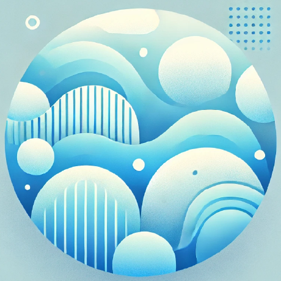 | 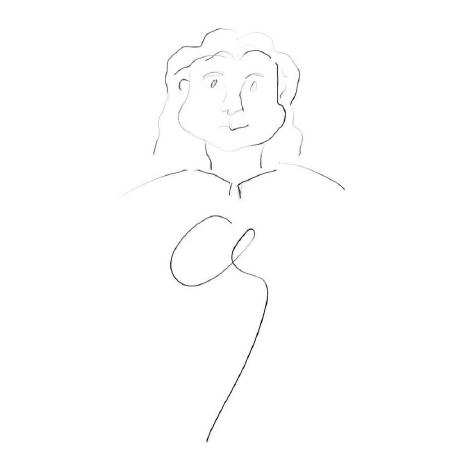 |     |
|                       👑팀장                       |                        팀원                        |                       팀원                        |                       팀원                        |                         팀원                         |
|      [GitHub](https://github.com/SongJwans)      |     [GitHub](https://github.com/jingun0516)      |    [GitHub](https://github.com/SangWon-Lee1)    |     [GitHub](https://github.com/goldsonge)      |      [GitHub](https://github.com/jeongggggg)       |
|        - 기능 구현<br/>- 버그 수정<br/>- 프로젝트 관리         |       - 기능 구현<br/>- 버그 수정<br/>- 외부 API 구현        |       - 기능 구현<br/>- 버그 수정<br/>- GitHub 관리       |       - 기능 구현<br/>- 버그 수정<br/>- 디자인 및 UI        | - 기능 구현<br/>- 버그 수정<br/>- 디자인 및 UI <br/>- 프로젝트 문서화 |

<br>
<br>

## 🤝 추가 구현 (가능하다면..)

- 문진표에 대한 정보가 좀더 자세하고 전문적인 정보를 가져다 준다면 좋은거 같습니다.
- 네이버 예약 기능 구현

<br>
<br>

## 🗨️ 프로젝트를 마치며...

- **송주환** :
- **김진건** :
- **이상원** :
- **장금송** :
- **조아정** : 
