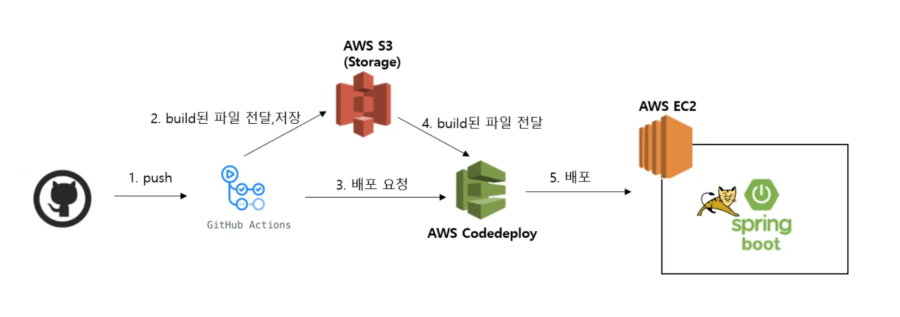
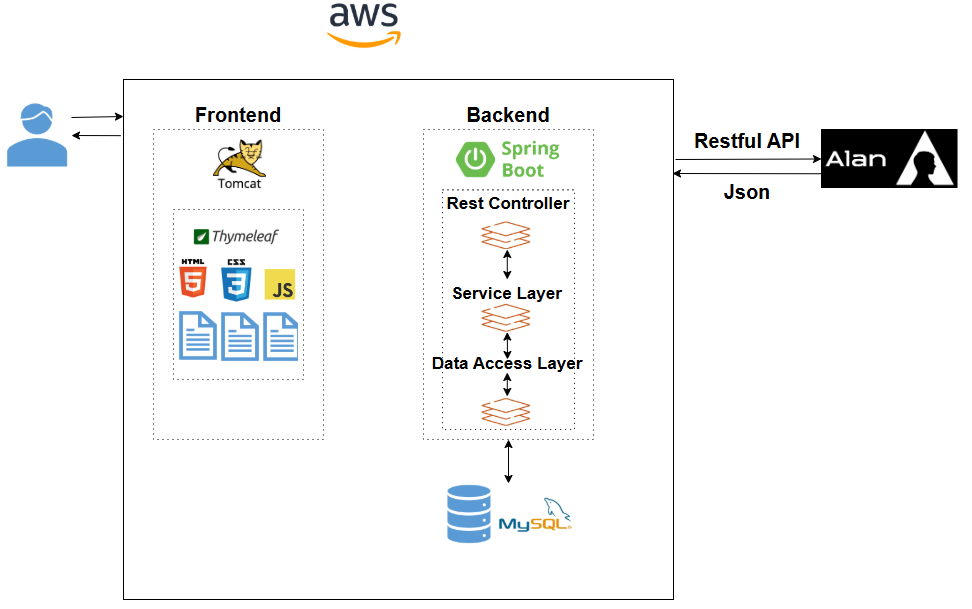

#  청춘은 바로 지금! (청바지)

#### <span style = "background : orange; color : #000; font-weight:bold;">"청바지" (청춘은 바로 지금) </span> 프로젝트는 건강에 관심이 많은 액티브 시니어를 대상으로 AI 기반 건강 정보 분석 서비스 및 다양한 공공의료기관, 요양원, 복지시설 정보를 제공합니다.


## 🍚 프로젝트 소개

대한민국은 2017년 고령사회에 진입했으며, 2024년 말에서 2025년 초에는 노인 인구가 전체 인구의 20%를 차지하는 **초고령사회**에 접어들 것으로 예상됩니다. 인구는 감소하고 노인 복지 비용은 증가하는
가운데, 은퇴 후에도 활발한 사회 활동과 여가를 즐기며 능동적으로 생활하고자 하는 50~60대 액티브 시니어들이 점점 늘어나고 있습니다.

이에 따라, **"청바지" (청춘은 바로 지금)** 프로젝트는 건강에 관심이 많은 액티브 시니어를 대상으로 AI 기반 건강 정보 분석 서비스 및 다양한 공공의료기관, 요양원, 복지시설 정보를 제공합니다.
**"청바지"는 단순한 건강 정보 제공을 넘어, 시니어들이 보다 행복하고 활기찬 삶을 영위할 수 있도록 돕는 플랫폼을 목표로 합니다.** 초고령사회에서도 젊은 마음으로 살아가려는 액티브 시니어들의 든든한 동반자가
되겠습니다.


<br>
<br>

## ⛓️ 배포 URL

[https://chungbaji.kro.kr](https://chungbaji.kro.kr)

<br>
<br>

## ⌛ 개발 기간

### 2024. 11.22 ~ 12.20

```mermaid
gantt
    title 청춘은 바로 지금 프로젝트 일정 
    dateFormat  YYYY-MM-DD
    axisFormat  %m-%d

    section 아이디어 회의 및 구상
    아이디어 회의 및 기능 구상 :done, 2024-11-22, 2024-11-25

    section 프로젝트 문서 설계
    와이어프레임, 데이터베이스 설계 :done, 2024-11-26, 2024-11-27
    RDS 생성, API 설계, ERD 설계 :done, 2024-11-27, 2024-11-28
    AWS EC2 생성, CI/CD 구축 :done, 2024-11-28, 2024-11-29

    section 기능 구현
    AI 건강검진, 병원정보찾기, 앨런아 알려줘 :active, 2024-11-28, 2024-12-03

    section HTML 구현
    HTML 구현 시작 :active, 2024-12-03, 2024-12-04
    HTML 데이터 삽입 :active, 2024-12-04, 2024-12-05

    section 추가 기능 구현 
    알림, 소셜 로그인, 카카오 맵, SMTP 기능 구현 :active, 2024-12-05, 2024-12-06
    
    section 테스트 및 버그 수정
    테스트 진행, 버그 수정, refactor :active, 2024-12-11, 2024-12-12
    
    section 문서 작성 및 코드 정리
    프로젝트 관련 문서 수정, 코드 정리 :done, 2024-12-16, 2024-12-17
    문서 작성, 추가 버그 수정 :done, 2024-12-17, 2024-12-18

    section 프로젝트 배포 및 발표 준비
    프로젝트 배포, 시연영상, 발표 준비 :active, 2024-12-17, 2024-12-20
    프로젝트 발표 :active, 2024-12-20, 2024-12-20
```



<br>
<br>

## 🏔️ 개발 환경

### Development


### Environment


### Development Tools


### Communication


<br>
<br>

## 🍜 기능 정의서

➡️ [notion 에서 확인하기](https://oreumi.notion.site/cc4079b6409c4ea9b9ce336d385ba51c?pvs=4)

### ⭐ 주요 기능

- 앨런 API 기반 **AI 건강 정보 분석**
- 앨런 API 기반 **AI 채팅**
- 구글, 카카오, 네이버 **소셜 로그인 기능**
- 외부 API 기반 **공공의료기관, 요양원, 복지시설 정보 제공**
- 공공의료기관 **간편 예약**
- 예약 확정 안내 및 예약 날짜 하루 전 리마인드 **알림 기능**


<br>
<br>

## ⚓ 시스템 아키텍처 구성도



<br>
<br>

## 🖼️ Sequence Diagram

### 건강 정보 분석

```mermaid
sequenceDiagram
    participant User as 사용자
    participant WebApp as 웹 애플리케이션
    participant AIAPI as AI API
    participant DB as 데이터베이스
    participant Compare as 비교 모듈

    User ->> WebApp: 문진표 작성 및 제출
    WebApp ->> AIAPI: 문진표 데이터 요청
    AIAPI -->> WebApp: 건강지수 및 건강 점수 반환
    WebApp ->> DB: 이전 결과 요청
    DB -->> WebApp: 이전 결과 반환
    WebApp ->> Compare: 결과 비교 요청
    Compare -->> WebApp: 비교 결과 반환
    WebApp -->> User: 비교 결과 응답
```



### 알려줘 앨런아!

```mermaid
sequenceDiagram
    actor User
    participant Server
    participant ChatController
    participant ChatService

%% AI 기반 대화 동반자
    User->>Server: AI 대화 요청
    Server->>ChatController: 요청 전달
    ChatController->>ChatService: AI 대화 처리 요청
    ChatService-->>ChatController: 대화 결과
    ChatController-->>Server: 응답 전달
    Server-->>User: AI 대화 응답

%% AI 비대면 진단
    User->>Server: AI 진단 요청
    Server->>ChatController: 요청 전달
    ChatController->>ChatService: AI 비대면 진단 처리
    ChatService-->>ChatController: 진단 결과
    ChatController-->>Server: 응답 전달
    Server-->>User: 진단 결과 응답
```



### 공공의료기관 찾기

```mermaid
sequenceDiagram
    participant User as Client
    participant FrontEnd as FrontPage
    participant Database as 데이터베이스

    User ->> FrontEnd: 지역 선택 후 병원 정보 요청
    FrontEnd ->> Database: 선택된 지역 정보 전달 및 병원 데이터 조회
    alt 병원 정보 있음
        Database -->> FrontEnd: 병원 정보 반환
        FrontEnd -->> User: 병원 정보 표시
    else 병원 정보 없음
        Database -->> FrontEnd: "병원 정보 없음" 응답
        FrontEnd -->> User: "해당 지역의 병원 정보가 없습니다" 메시지 표시
    end

    User ->> FrontEnd: 예약 정보 입력
    FrontEnd ->> Database: 예약 정보 전달 및 저장 요청
    Database -->> FrontEnd: 예약 정보 저장 완료
    FrontEnd -->> User: 예약 완료 메시지 표시

```



<br>
<br>

## 👀 화면 설계

➡️ [figma 에서 확인하기](https://www.figma.com/design/E9nwpp2MsdbKAIoSyrQ6Ot/%EC%B2%AD%EB%B0%94%EC%A7%80---%EC%99%80%EC%9D%B4%EC%96%B4%ED%94%84%EB%A0%88%EC%9E%84?node-id=0-1&t=LJryapQWiEW2EZ3k-1)

### ✅ 프론트


### ✅ 관리자


<br>
<br>

## 🛫 ERD(Entity Relationship Diagram)


<br>
<br>

# 🚩 API 명세서

## 🚀 **REST API**

### 📌 **유저 관리**

| **Method** | **URL**                           | **Description**  |
|------------|-----------------------------------|------------------|
| POST       | `/api/users/register`             | 회원가입             |
| GET        | `/api/users/{userId}`             | 유저 정보 조회 (마이페이지) |
| PUT        | `/api/users/{userId}`             | 회원 정보 수정         |
| POST       | `/api/users/withdrawal`           | 회원 탈퇴 (소프트 딜리트)  |
| DELETE     | `/api/users/{userId}`             | 회원 삭제            |
| POST       | `/api/users/searchId`             | 아이디 찾기           |
| POST       | `/api/users/checkId`              | 아이디 중복 확인        |
| POST       | `/api/users/checkNickname`        | 닉네임 중복 확인        |
| POST       | `/api/users/checkEmail`           | 이메일 중복 확인        |
| POST       | `/api/users/checkEmailAndLoginId` | 비밀번호 찾기 시 이메일 확인 |
| GET        | `/api/users/nickname`             | 로그인된 유저 닉네임 반환   |
| POST       | `/api/users/validateSignup`       | 회원가입 폼 검증   |
---

### 👨‍👩‍👧 **가족 정보**

| **Method** | **URL**                  | **Description** |
|------------|--------------------------|-----------------|
| POST       | `/api/family`            | 가족 정보 저장        |
| GET        | `/api/family`            | 가족 정보 조회        |
| DELETE     | `/api/family/{familyId}` | 가족 정보 삭제        |

---

### 🧧 **운세**

| **Method** | **URL**     | **Description** |
|------------|-------------|-----------------|
| GET        | `/api/bazi` | 오늘의 운세 결과 출력    |

---

### 🩺 **건강검진**

| **Method** | **URL**                       | **Description** |
|------------|-------------------------------|-----------------|
| POST       | `/api/analysis/questionnaire` | 기본 문진표 분석       |
| POST       | `/api/analysis/dementia`      | 치매 관련 문진표 분석    |

---

### 💬 **대화 기능**

| **Method** | **URL**                  | **Description** |
|------------|--------------------------|-----------------|
| GET        | `/api/chat/stream`       | SSE 연결          |
| GET        | `/api/chat/send`         | 메시지 전송 및 브로드캐스트 |
| POST       | `/api/chat/stream/close` | SSE 연결 종료       |

---

### 🏥 **병원 관리**

| **Method** | **URL**                  | **Description** |
|------------|--------------------------|-----------------|
| POST       | `/api/hospitals`         | 전체 병원 목록 저장     |
| GET        | `/api/hospitals`         | 병원 목록 조회        |
| GET        | `/api/hospitals/search/` | 병원 이름으로 검색      |

---

### 🏥 **요양 병원 관리**

| **Method** | **URL**           | **Description** |
|------------|-------------------|-----------------|
| POST       | `/api/sanatorium` | 요양 병원 목록 저장     |
| GET        | `/api/sanatorium` | 요양 병원 목록 조회     |

---

### 🏠 **복지 시설 관리**

| **Method** | **URL**        | **Description** |
|------------|----------------|-----------------|
| POST       | `/api/nursing` | 복지 시설 목록 저장     |
| GET        | `/api/nursing` | 복지 시설 목록 조회     |

---

### 🌐 **지역 주소 저장**

| **Method** | **URL**             | **Description** |
|------------|---------------------|-----------------|
| POST       | `/api/address-code` | 주소코드 매핑 정보 저장   |

---

### 🔐 **관리자**

| **Method** | **URL**                  | **Description** |
|------------|--------------------------|-----------------|
| POST       | `/api/admin/login`       | 관리자 로그인         |
| GET        | `/api/admin/users`       | 관리자 회원 관리 리스트   |
| GET        | `/api/admin/member-list` | 회원 이름 검색        |

---

### 📅 **예약**

| **Method** | **URL**                      | **Description** |
|------------|------------------------------|-----------------|
| GET        | `/api/reservation/stream`    | SSE 연결          |
| POST       | `/api/reservation`           | 예약 추가하기         |
| GET        | `/api/reservations`          | 전체 예약 정보 조회     |
| GET        | `/api/notifications`         | 전체 알림 정보 조회     |
| DELETE     | `/api/reservation/{id}`      | 알림 삭제           |
| PATCH      | `/api/reservation/read/{id}` | 알림 읽음 여부 토글     |

---
## 🌐 **랜더링 관련 API**

### 🏠 **메인**

| **Method** | **URL** | **HTML File Name** | **Description** |
|------------|---------|--------------------|-----------------|
| GET        | `/`     | `index.html`       | 메인 화면           |

### 👤 **유저**

| **Method** | **URL**                      | **HTML File Name**            | **Description**                     |
|------------|------------------------------|--------------------------------|-------------------------------------|
| GET        | `/login`                    | `login.html`                  | 로그인 화면                         |
| GET        | `/signup`                   | `signup.html`                 | 회원가입 화면                       |
| POST       | `/signup`                   | `signup.html`                 | 회원가입 처리                       |
| GET        | `/success`                  | `success.html`                | 회원가입 완료 화면                  |
| GET        | `/find-id`                  | `find-id.html`                | 아이디 찾기 화면                    |
| POST       | `/find-id`                  | `find-id.html`                | 아이디 찾기 처리                    |
| GET        | `/find-pw`                  | `find-pw.html`                | 비밀번호 찾기 화면                  |
| POST       | `/find-pw`                  | `find-pw.html`                | 비밀번호 찾기 처리                  |
| GET        | `/change-pw`                | `change-pw.html`              | 비밀번호 변경 화면                  |
| POST       | `/change-pw`                | `change-pw.html`              | 비밀번호 변경 처리                  |
| GET        | `/change-pw-after-find`     | `change-pw-after-find.html`   | 비밀번호 찾은 후 변경 화면          |
| POST       | `/change-pw-after-find`     | `change-pw-after-find.html`   | 비밀번호 찾은 후 변경 처리          |
| GET        | `/mypage`                   | `mypage.html`                 | 마이페이지                          |
| GET        | `/edit-profile`             | `edit-profile.html`           | 개인정보 수정 화면                  |
| POST       | `/edit-profile`             | `mypage.html`                 | 개인정보 수정 처리                  |
| GET        | `/edit-family`              | `edit-family.html`            | 가족 정보 수정 화면                 |
| GET        | `/withdrawal`               | `withdrawal.html`             | 회원 탈퇴 화면                      |
| GET        | `/chat`                     | `chat.html`                   | 앨런아 알려줘 페이지                 |

### 🏥 **병원**

| **Method** | **URL**            | **HTML File Name** | **Description**           |
|------------|--------------------|--------------------|---------------------------|
| GET        | `/hospital-list`  | `hospital-list.html` | 병원 목록 리스트            |

### 🏡 **요양**

| **Method** | **URL**            | **HTML File Name** | **Description**           |
|------------|--------------------|--------------------|---------------------------|
| GET        | `/nursing-list`   | `nursing-list.html` | 요양병원 목록 리스트         |

### 🏢 **복지시설**

| **Method** | **URL**            | **HTML File Name** | **Description**           |
|------------|--------------------|--------------------|---------------------------|
| GET        | `/sanatorium-list` | `sanatorium-list.html` | 복지시설 목록 리스트        |

### 🩺 **건강검진**

| **Method** | **URL**                            | **HTML File Name**          | **Description**                  |
|------------|------------------------------------|-----------------------------|----------------------------------|
| GET        | `/checkout`                       | `checkout.html`             | 건강 검진 메인화면               |
| GET        | `/checkout/checkout-list`         | `checkout-list.html`        | 검사 유형 선택 페이지            |
| GET        | `/checkout/questionnaire-list`    | `questionnaire-list.html`   | 기본 검사 페이지                 |
| POST       | `/checkout/questionnaire-list`    | `result-questionnaire.html` | 기본 검사 요청 기능              |
| GET        | `/checkout/result-questionnaire`  | `result.html`               | 기본 검사 결과 페이지            |
| GET        | `/checkout/dementia-list`         | `dementia-list.html`        | 치매 검사 페이지                 |
| POST       | `/checkout/dementia-list`         | `result-dementia`           | 치매 검사 요청 기능              |
| GET        | `/checkout/result-dementia`       | `result.html`               | 치매 검사 결과 페이지            |
| GET        | `/checkout/result-statistics`     | `result-statistics.html`    | 검사 결과 통계 페이지            |
| GET        | `/checkout/result-list`           | `result-list.html`          | 검사 결과 목록 페이지            |
| GET        | `/checkout/result-detail/{reportId}` | `result-detail.html`     | 검사 결과 상세 페이지            |

### 🛠️ **관리자**

| **Method** | **URL**                          | **HTML File Name**     | **Description**          |
|------------|----------------------------------|------------------------|--------------------------|
| GET        | `/admin`                        | `admin-index.html`     | 관리자 메인               |
| GET        | `/admin/member/list`            | `member-list.html`     | 회원 목록                 |
| GET        | `/admin/member/edit/{id}`       | `member-edit.html`     | 개별 회원 정보 조회       |
| POST       | `/admin/member/edit/{id}`       | `member-edit.html`     | 개별 회원 등급 수정       |
| POST       | `/admin/member/delete/{id}`     | `member-list.html`     | 개별 회원 탈퇴            |
| GET        | `/access-denied`                | `access-denied.html`   | 접근 제한 페이지           |


<br>
<br>

## 👾 프로젝트 구조

### 🚶‍♀️‍➡️Front-End

```
📁 main 
└── 📁 resources 
    ├── 📁 static 
    │   ├── 📁 admin   
    │   │   └── 📁 css 
    │   ├── 📁 css 
    │   │   ├── 📁 checkout 
    │   │   ├── 📁 info 
    │   │   └── 📁 member  
    │   ├── 📁 img️  
    │   └── 📁 js 
    └── 📁 templates  
        ├── 📁 admin 
        │   ├── 📁 layout 
        │   └── 📁 member  
        ├── 📁 chat  
        ├── 📁 checkout 
        ├── 📁 error 
        ├── 📁 info 
        ├── 📁 layout 
        └── 📁 member 
```

### 🚶‍♂️ Back-End

```
└── 📁 main  
    └── 📁 java  
        └── 📁 com  
            └── 📁 example  
                └── 📁 classicjeans  
                    ├── 📁 addresscode   
                    │   ├── 📁controller 
                    │   ├── 📁dto 
                    │   │   └── 📁request  
                    │   ├── 📁entity 
                    │   ├── 📁repository 
                    │   └── 📁service  
                    ├── 📁admin  
                    │   ├── 📁controller 
                    │   └── 📁service 
                    ├── 📁config 
                    ├── 📁controller
                    │   ├── 📁rest
                    │   └── 📁view 
                    ├── 📁dto 
                    │   ├── 📁request 
                    │   └── 📁response 
                    ├── 📁email 
                    │   ├── 📁config   
                    │   ├── 📁controller 
                    │   └── 📁service 
                    ├── 📁entity  
                    ├── 📁enums   
                    │   └── 📁questionnaire
                    ├── 📁oauth  
                    ├── 📁repository 
                    ├── 📁security   
                    ├── 📁service  
                    └── 📁util
```

<br>
<br>

## 🖲️ 화면 구현 (시연 영상)
### 🚀 UI 구현 시 집중 포인트

✅ **큼직하고 가독성 높은 텍스트** <br>
✅ **명확한 경고 및 안내 텍스트** <br>
✅ **반응형 웹디자인 지원**  <br>
✅ **건강 검진 통계 결과 시각화**
<br>
<br>
<table>
    <tbody>
        <tr>
            <td>메인화면(로그인 전)</td>
             <td>메인화면(로그인 후) + 오늘의 운세</td>
        </tr>
        <tr>
            <td>
		        
            </td>
            <td>
                
            </td>
        </tr>
        <tr>
            <td>AI 건강검진</td>
            <td>알려줘 앨런아!</td>
        </tr>
        <tr>
            <td>
                
            </td>
            <td>
                
            </td>
        </tr>
        <tr>
            <td>정보마당</td>
            <td>공공의료기관 간편예약 및 알림</td>
        </tr>
        <tr>
            <td>
                
            </td>
            <td>
                
            </td>
        </tr>
    </tbody>
</table>

<br>
<br>

### 🌟 시연 영상

[](https://youtu.be/2M4xkKO4Msw)
클릭하면 동영상이 재생됩니다.
<br>
<br>

## 🧵 코딩 컨벤션

- Java Coding Convention

<br>
<br>

## 🫡 CHUNGBAJI 팀원 소개 및 역할 분담

|                         송주환                          |                            김진건                             |                                  이상원                                  |                             장금송                              |                              조아정                               |
|:----------------------------------------------------:|:----------------------------------------------------------:|:---------------------------------------------------------------------:|:------------------------------------------------------------:|:--------------------------------------------------------------:|
|      |            |                        |               |                 |
|                         👑팀장                         |                             팀원                             |                                  팀원                                   |                              팀원                              |                               팀원                               |
|        [GitHub](https://github.com/SongJwans)        |          [GitHub](https://github.com/jingun0516)           |               [GitHub](https://github.com/SangWon-Lee1)               |            [GitHub](https://github.com/goldsonge)            |            [GitHub](https://github.com/jeongggggg)             |
| - 프로젝트 총 관리<br/>-앨런아 도와줘! (AI chat) <br/>- Server 구축 | - 유저 관리<br/>- OAuth2 소셜 로그인<br/>- 공공의료기관 알림 <br/>- ERD 명세서 | - AI 정보 분석 관련 <br/>- 회원 가족 관리 <br/>- Notion / GitHub 관리 <br/>-API 명세서 | - AI 오늘의 운세 <br/>- 검진 결과 다운로드 <br/>- 디자인 및 UI <br/>- 와이어 프레임 | - 병-의원 정보 외부 API<br/>- 디자인 및 UI <br/>- 와이어 프레임 <br/>- 반응형 웹 구축 |

<br>
<br>

## 🤝 추가 구현 예정

- 모바일 앱 구현 (IOS, Android)
- 실제 병·의원 연계하여 예약 
- 성능 개선을 위한 실질적인 조치

<br>
<br>

## 🗨️ 프로젝트를 마치며...

- **송주환**  
  스트레스 없이 행복하게 프로젝트 진행한 거 같습니다. 하시는 일 모두 대박 나시길!!  
  정말 정말 감사합니다~ 일주일 남았지만 메리크리스마스🎄

- **김진건**  
  자 이제 다음 프로젝트 준비하시죠.

- **이상원**  
  마지막 프로젝트를 열정 넘치는 여러분과 함께할 수 있어 정말 즐거운 4주였습니다.  
  앞으로도 모두 좋은 일만 가득하시길 진심으로 바랍니다! 👍🏼

- **장금송**  
  👖 프로젝트 기간 동안 모두 고생 많으셨고 덕분에 좋은 동료와 많은 걸 배워 갑니다.  
  앞으로도 건강 잘 챙기시고 늘 응원하겠습니다. :-) 👖

- **조아정**  
  손발 잘 맞는 팀원들과 협업하며 많이 배우고 성장할 수 있었습니다.  
  앞으로도 늘 행복하시길 바랍니다! 🍀 


