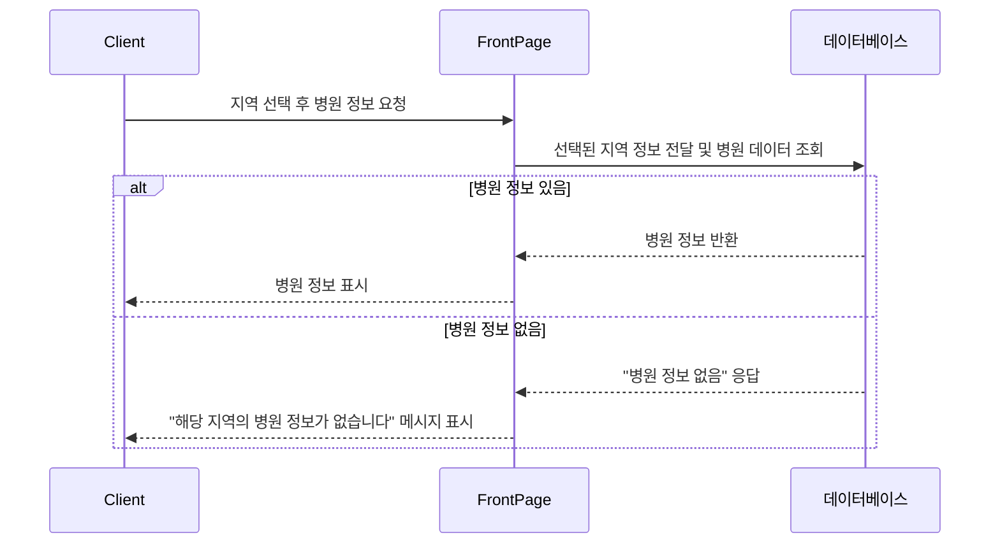

```mermaid
sequenceDiagram
    participant User as Client
    participant FrontEnd as FrontPage
    participant Database as 데이터베이스

    User ->> FrontEnd: 지역 선택 후 병원 정보 요청
    FrontEnd ->> Database: 선택된 지역 정보 전달 및 병원 데이터 조회
    alt 병원 정보 있음
        Database -->> FrontEnd: 병원 정보 반환
        FrontEnd -->> User: 병원 정보 표시
    else 병원 정보 없음
        Database -->> FrontEnd: "병원 정보 없음" 응답
        FrontEnd -->> User: "해당 지역의 병원 정보가 없습니다" 메시지 표시
    end
```