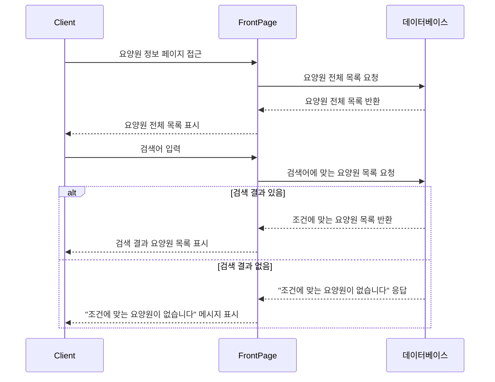

```mermaid
sequenceDiagram
    participant User as Client
    participant FrontEnd as FrontPage
    participant Database as 데이터베이스

    User ->> FrontEnd: 요양원 정보 페이지 접근
    FrontEnd ->> Database: 요양원 전체 목록 요청
    Database -->> FrontEnd: 요양원 전체 목록 반환
    FrontEnd -->> User: 요양원 전체 목록 표시

    User ->> FrontEnd: 검색어 입력
    FrontEnd ->> Database: 검색어에 맞는 요양원 목록 요청
    alt 검색 결과 있음
        Database -->> FrontEnd: 조건에 맞는 요양원 목록 반환
        FrontEnd -->> User: 검색 결과 요양원 목록 표시
    else 검색 결과 없음
        Database -->> FrontEnd: "조건에 맞는 요양원이 없습니다" 응답
        FrontEnd -->> User: "조건에 맞는 요양원이 없습니다" 메시지 표시
    end
```