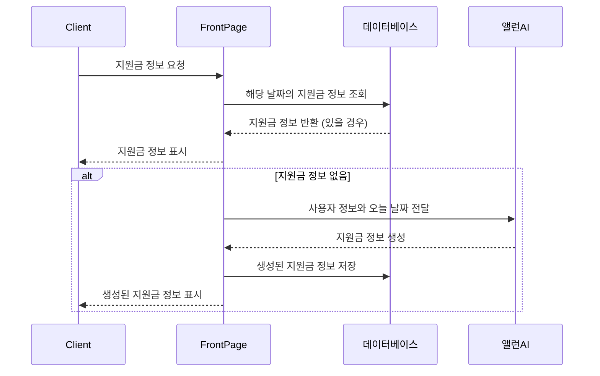

```mermaid
sequenceDiagram
    participant User as Client
    participant FrontEnd as FrontPage
    participant Database as 데이터베이스
    participant AIModel as 앨런AI

    User ->> FrontEnd: 지원금 정보 요청
    FrontEnd ->> Database: 해당 날짜의 지원금 정보 조회
    Database -->> FrontEnd: 지원금 정보 반환 (있을 경우)
    FrontEnd -->> User: 지원금 정보 표시

    alt 지원금 정보 없음
        FrontEnd ->> AIModel: 사용자 정보와 오늘 날짜 전달
        AIModel -->> FrontEnd: 지원금 정보 생성
        FrontEnd ->> Database: 생성된 지원금 정보 저장
        FrontEnd -->> User: 생성된 지원금 정보 표시
    end
```