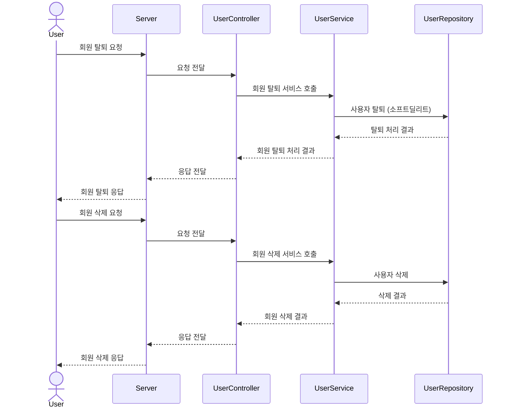

```mermaid
sequenceDiagram
    actor User
    participant Server
    participant UserController
    participant UserService
    participant UserRepository

    User->>Server: 회원 탈퇴 요청
    Server->>UserController: 요청 전달
    UserController->>UserService: 회원 탈퇴 서비스 호출
    UserService->>UserRepository: 사용자 탈퇴 (소프트딜리트)
    UserRepository-->>UserService: 탈퇴 처리 결과
    UserService-->>UserController: 회원 탈퇴 처리 결과
    UserController-->>Server: 응답 전달
    Server-->>User: 회원 탈퇴 응답

    User->>Server: 회원 삭제 요청
    Server->>UserController: 요청 전달
    UserController->>UserService: 회원 삭제 서비스 호출
    UserService->>UserRepository: 사용자 삭제
    UserRepository-->>UserService: 삭제 결과
    UserService-->>UserController: 회원 삭제 결과
    UserController-->>Server: 응답 전달
    Server-->>User: 회원 삭제 응답
```