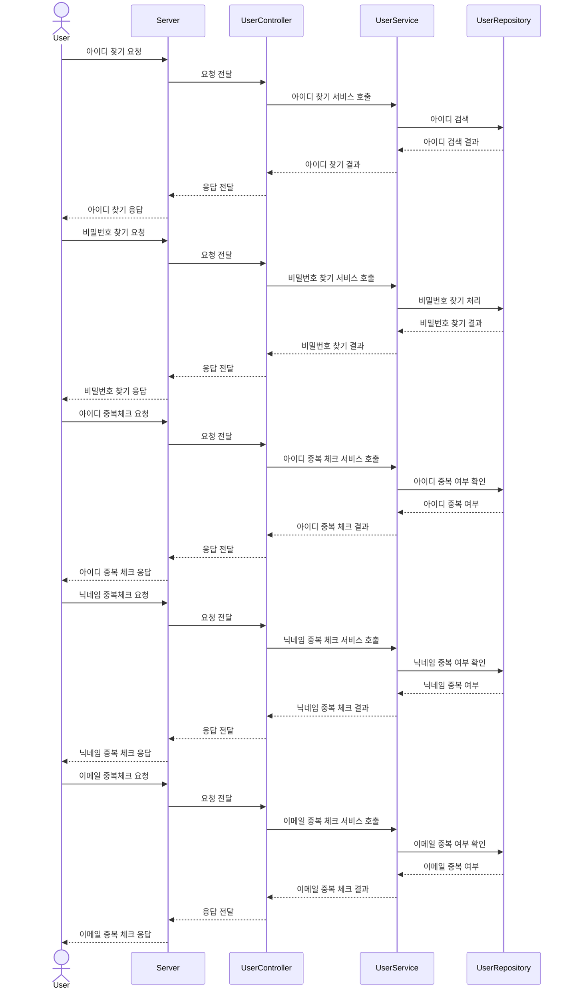

```mermaid
sequenceDiagram
    actor User
    participant Server
    participant UserController
    participant UserService
    participant UserRepository

    User->>Server: 아이디 찾기 요청
    Server->>UserController: 요청 전달
    UserController->>UserService: 아이디 찾기 서비스 호출
    UserService->>UserRepository: 아이디 검색
    UserRepository-->>UserService: 아이디 검색 결과
    UserService-->>UserController: 아이디 찾기 결과
    UserController-->>Server: 응답 전달
    Server-->>User: 아이디 찾기 응답

    User->>Server: 비밀번호 찾기 요청
    Server->>UserController: 요청 전달
    UserController->>UserService: 비밀번호 찾기 서비스 호출
    UserService->>UserRepository: 비밀번호 찾기 처리
    UserRepository-->>UserService: 비밀번호 찾기 결과
    UserService-->>UserController: 비밀번호 찾기 결과
    UserController-->>Server: 응답 전달
    Server-->>User: 비밀번호 찾기 응답

    User->>Server: 아이디 중복체크 요청
    Server->>UserController: 요청 전달
    UserController->>UserService: 아이디 중복 체크 서비스 호출
    UserService->>UserRepository: 아이디 중복 여부 확인
    UserRepository-->>UserService: 아이디 중복 여부
    UserService-->>UserController: 아이디 중복 체크 결과
    UserController-->>Server: 응답 전달
    Server-->>User: 아이디 중복 체크 응답

    User->>Server: 닉네임 중복체크 요청
    Server->>UserController: 요청 전달
    UserController->>UserService: 닉네임 중복 체크 서비스 호출
    UserService->>UserRepository: 닉네임 중복 여부 확인
    UserRepository-->>UserService: 닉네임 중복 여부
    UserService-->>UserController: 닉네임 중복 체크 결과
    UserController-->>Server: 응답 전달
    Server-->>User: 닉네임 중복 체크 응답

    User->>Server: 이메일 중복체크 요청
    Server->>UserController: 요청 전달
    UserController->>UserService: 이메일 중복 체크 서비스 호출
    UserService->>UserRepository: 이메일 중복 여부 확인
    UserRepository-->>UserService: 이메일 중복 여부
    UserService-->>UserController: 이메일 중복 체크 결과
    UserController-->>Server: 응답 전달
    Server-->>User: 이메일 중복 체크 응답
```