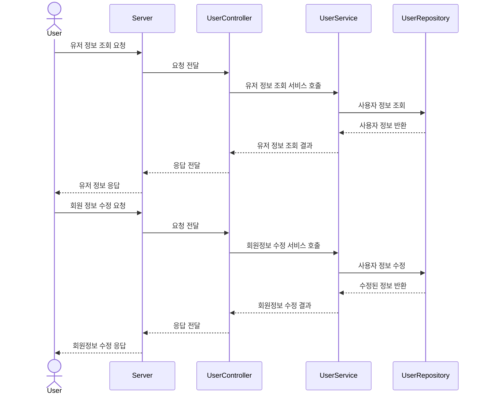

```mermaid
sequenceDiagram
    actor User
    participant Server
    participant UserController
    participant UserService
    participant UserRepository

    User->>Server: 유저 정보 조회 요청
    Server->>UserController: 요청 전달
    UserController->>UserService: 유저 정보 조회 서비스 호출
    UserService->>UserRepository: 사용자 정보 조회
    UserRepository-->>UserService: 사용자 정보 반환
    UserService-->>UserController: 유저 정보 조회 결과
    UserController-->>Server: 응답 전달
    Server-->>User: 유저 정보 응답

    User->>Server: 회원 정보 수정 요청
    Server->>UserController: 요청 전달
    UserController->>UserService: 회원정보 수정 서비스 호출
    UserService->>UserRepository: 사용자 정보 수정
    UserRepository-->>UserService: 수정된 정보 반환
    UserService-->>UserController: 회원정보 수정 결과
    UserController-->>Server: 응답 전달
    Server-->>User: 회원정보 수정 응답
```